# Zeerak AI — App Screenshots

High-quality screenshots of the Zeerak AI web application, captured at production-quality resolution for showcase and mockup purposes.

## Desktop Screenshots (1440×900)

| Screenshot | Page | Description |
|---|---|---|
| 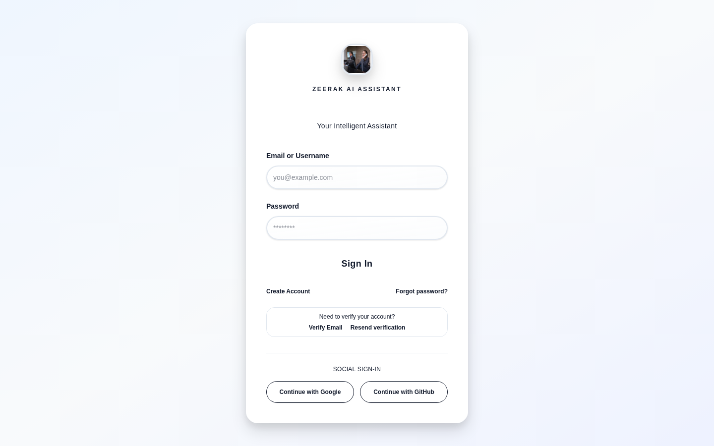 | **Login** | Authentication screen — English |
| 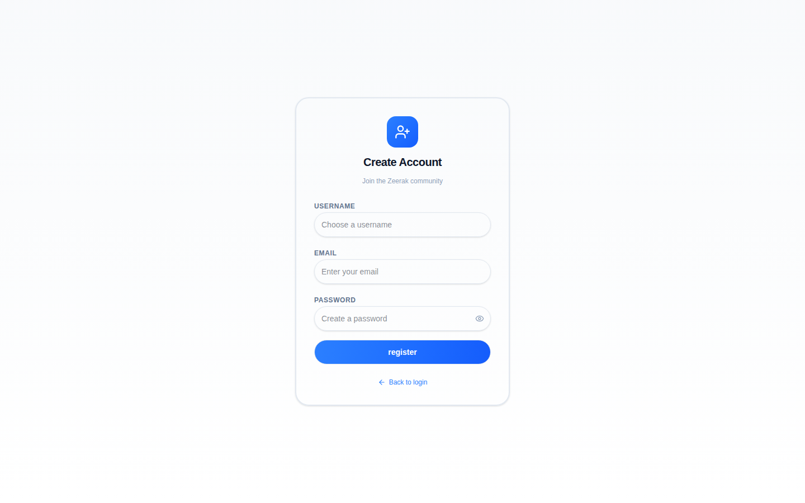 | **Register** | New user registration |
| 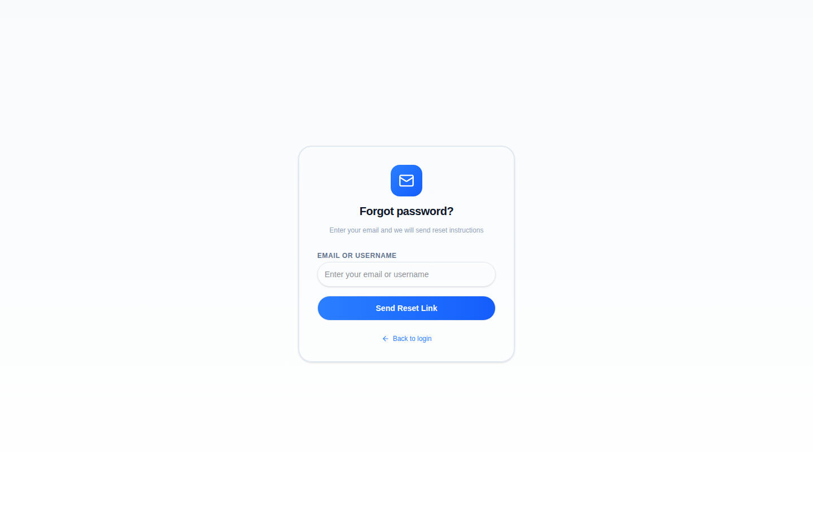 | **Forgot Password** | Password recovery |
| 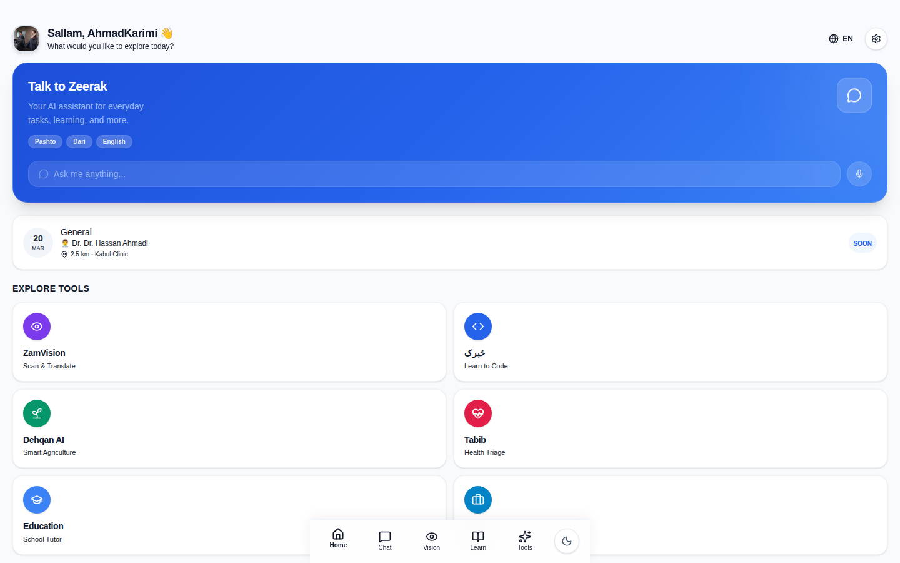 | **Home Dashboard** | Main dashboard with market prices, stats, and quick actions |
| 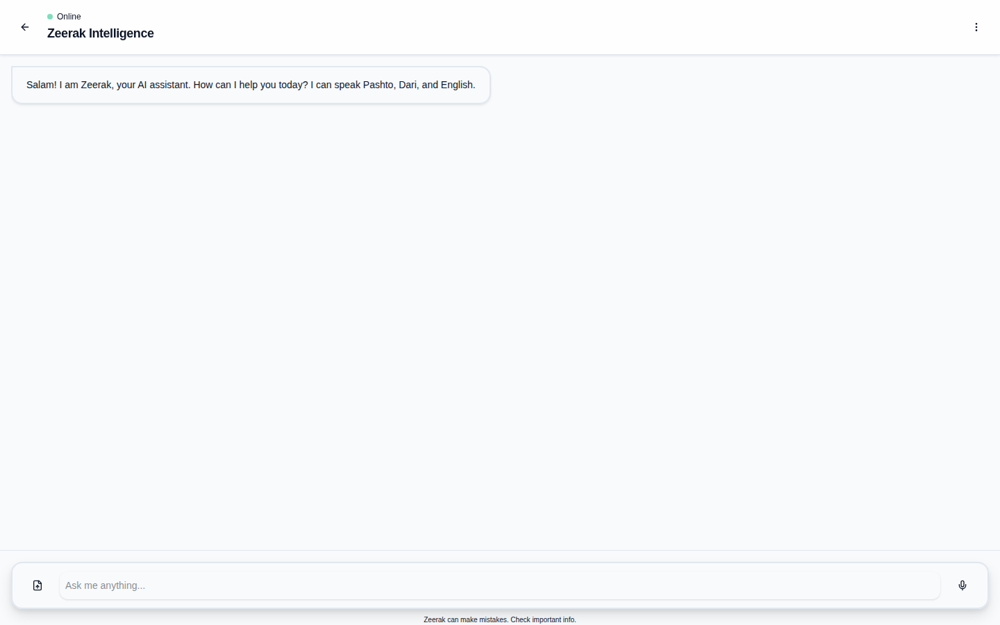 | **AI Chat** | Zeerak Chat — multilingual AI conversation (Pashto/Dari/English) |
| 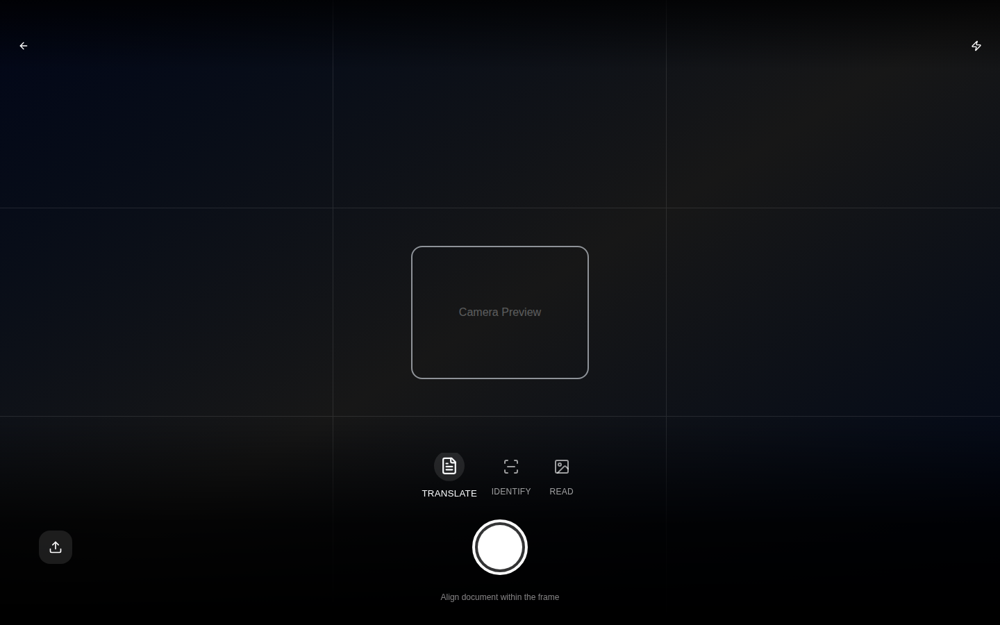 | **Vision AI** | Camera-based OCR, translation, and object recognition |
| 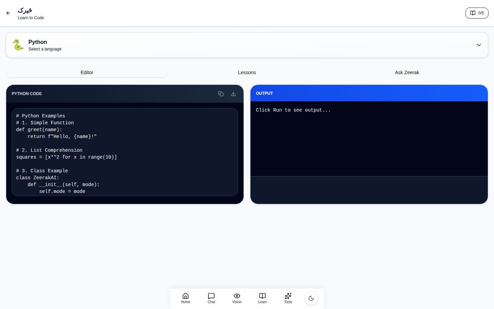 | **CodeKhona** | Interactive code playground (Python, JavaScript, HTML/CSS) |
| 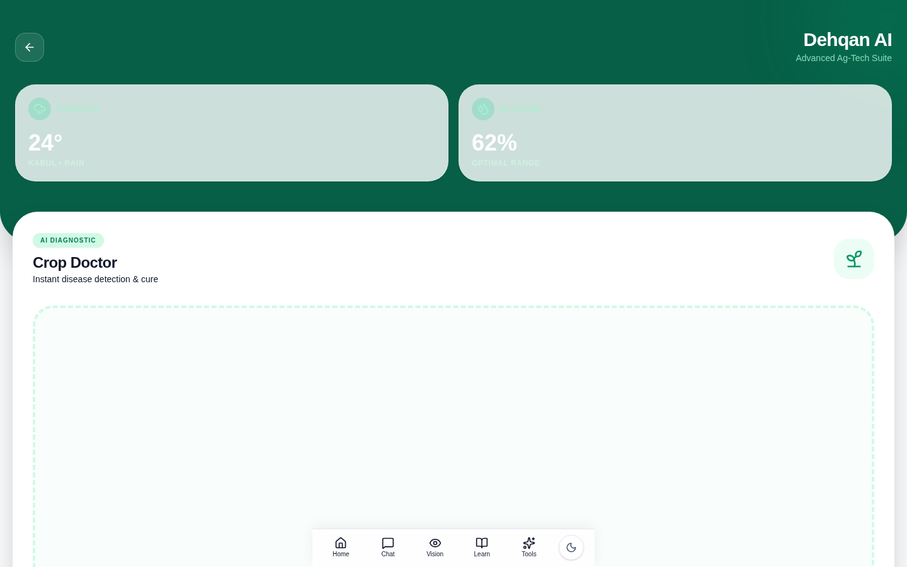 | **Dehqan AI** | Agriculture assistant — crop disease, market prices, weather |
| 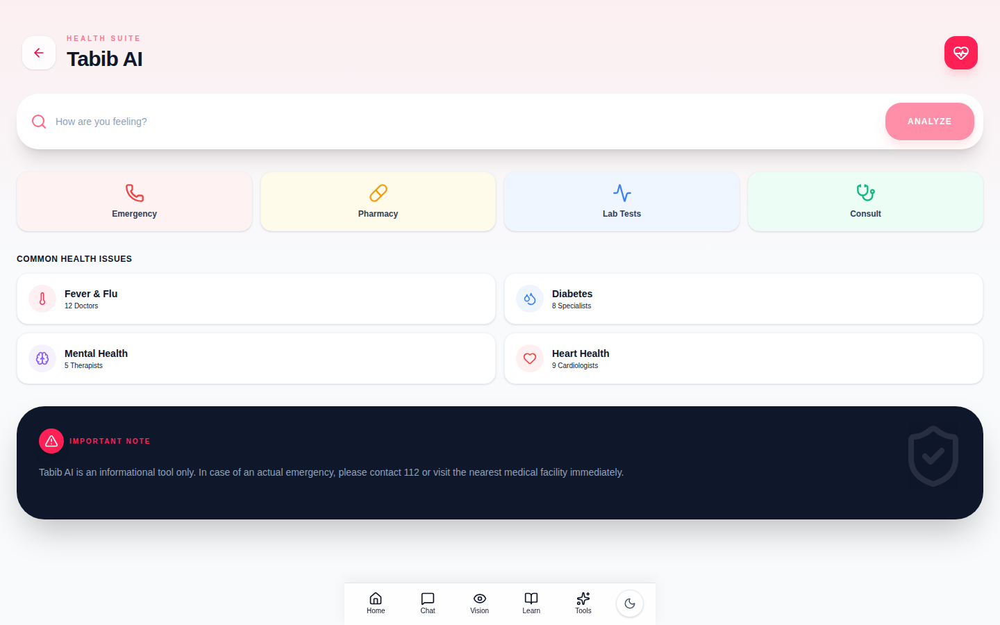 | **Tabib AI** | Health assistant — symptom checker, appointments, specialists |
| 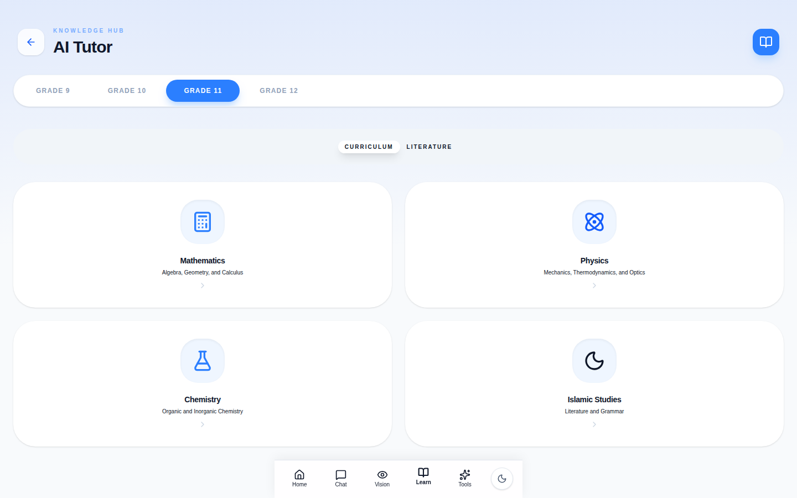 | **AI Tutor** | Afghan curriculum tutoring (Classes 6–12) |
| 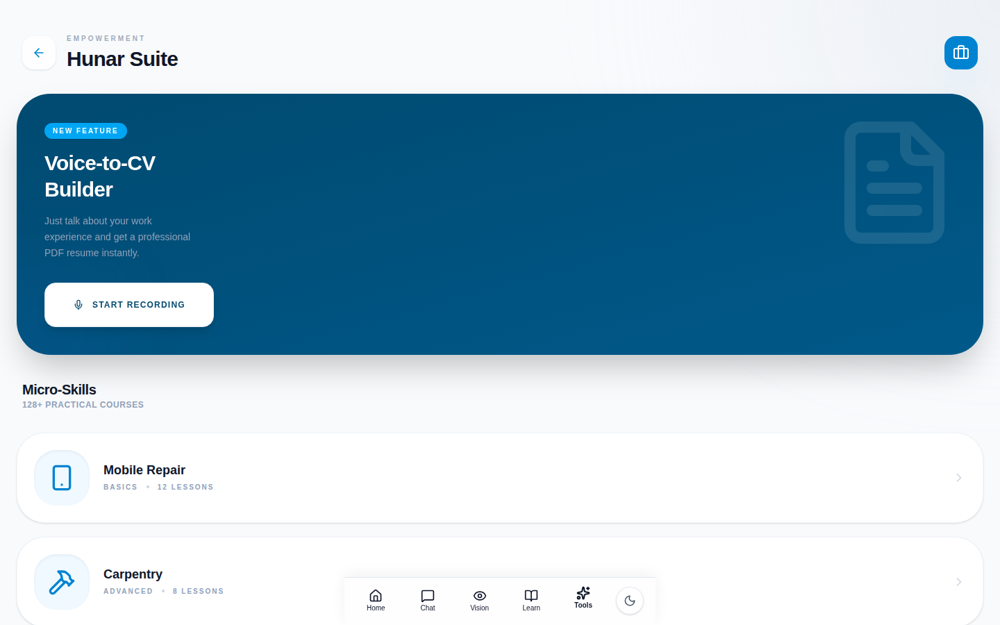 | **Hunar Suite** | Vocational skills training and AI resume builder |
| 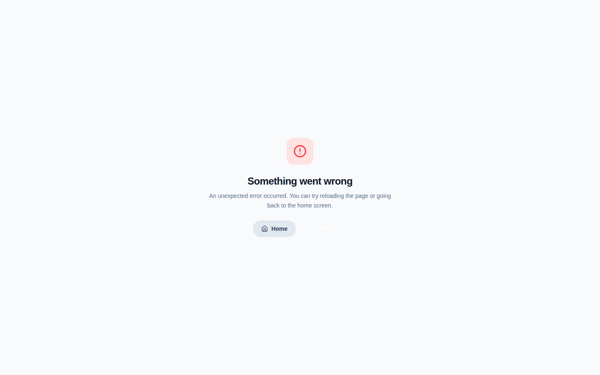 | **Settings** | User preferences, language, and app settings |
| 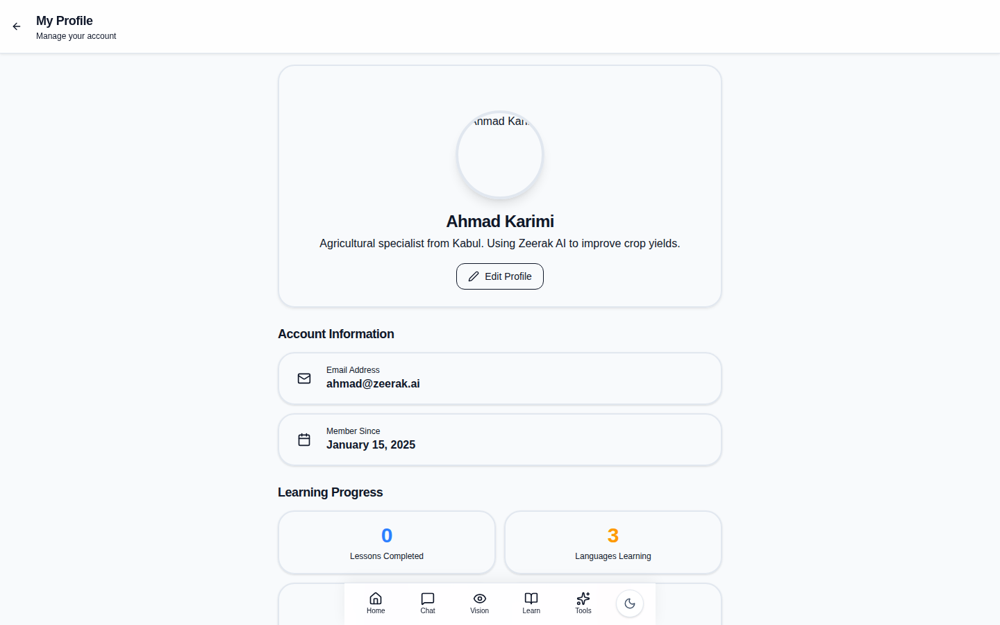 | **Profile** | User profile and account management |
|  | **Pricing** | Subscription plans and pricing |

## Wide Desktop Screenshots (1920×1080)

| Screenshot | Page |
|---|---|
| 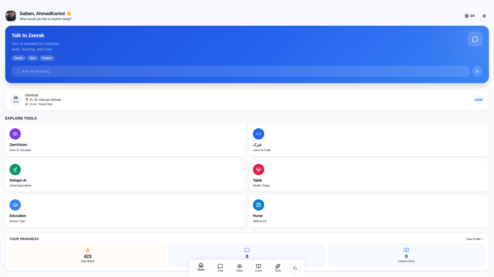 | **Home Dashboard** — Full HD |

## Mobile Screenshots (390×844 — iPhone 14 Pro)

| Screenshot | Page |
|---|---|
| 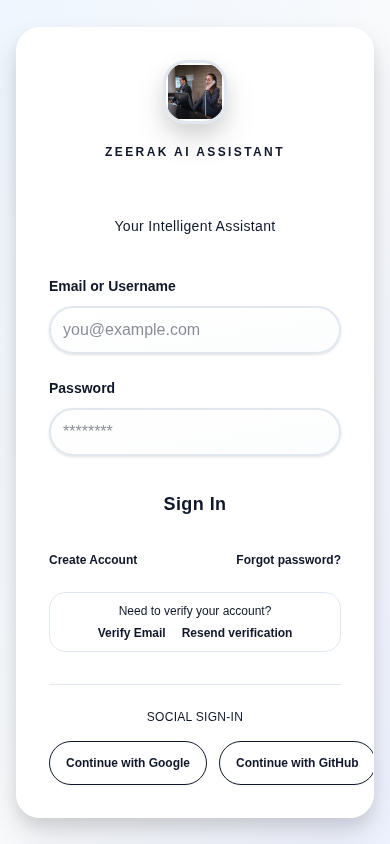 | **Login** |
| 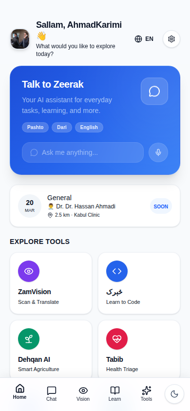 | **Home Dashboard** |
| 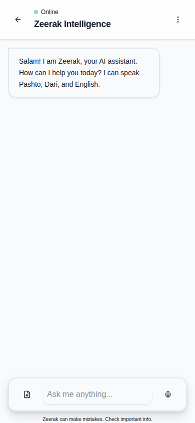 | **AI Chat** |
| 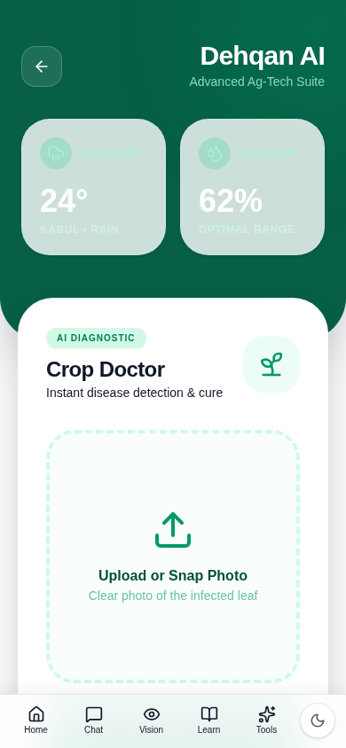 | **Dehqan AI** |
| 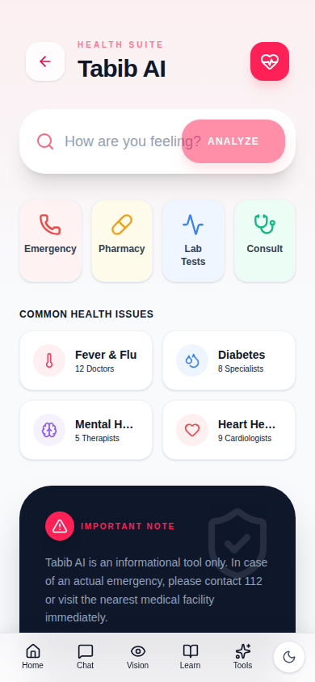 | **Tabib AI** |

## Technical Details

- **Captured with**: Playwright (Chromium headless shell)
- **Demo mode**: VITE_DEMO_MODE=true — no backend required
- **API mocking**: All `/api/**` endpoints mocked with realistic demo data
- **Demo user**: Ahmad Karimi (Premium account, authenticated)
- **Viewports**:
  - Desktop: 1440×900
  - Wide: 1920×1080
  - Mobile: 390×844

## Regenerating Screenshots

```bash
# Build demo version
VITE_DEMO_MODE=true npx vite build --outDir /tmp/dist-demo

# Run screenshot script
node /tmp/playwright-final.js
```
